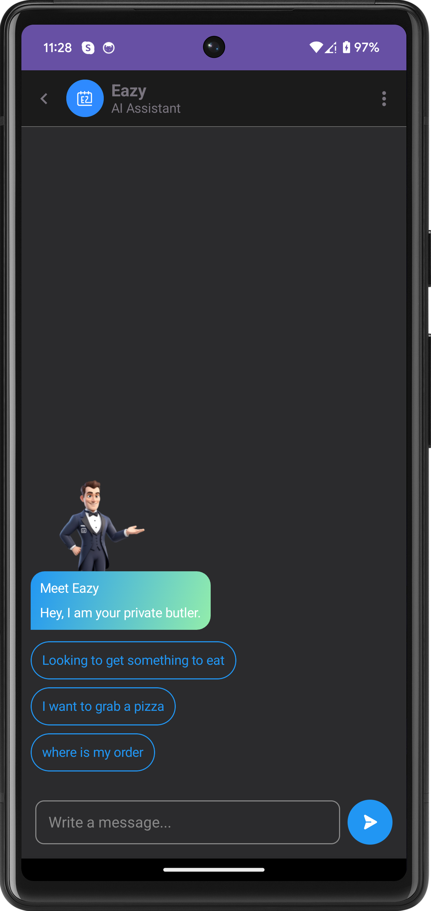
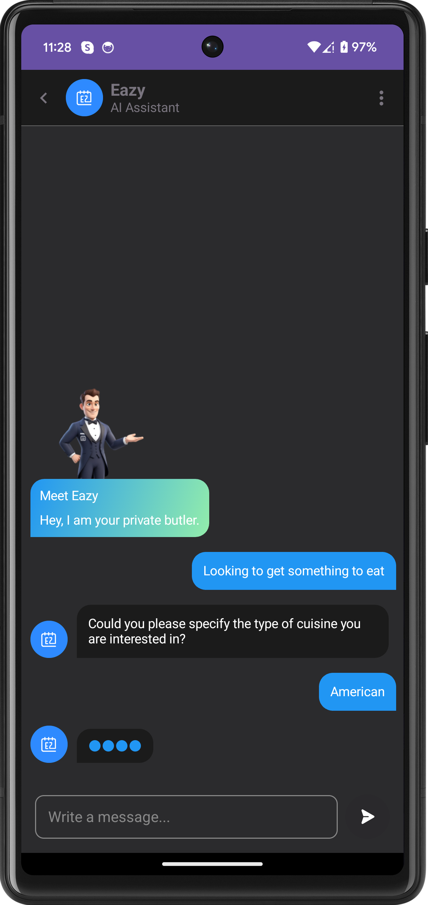
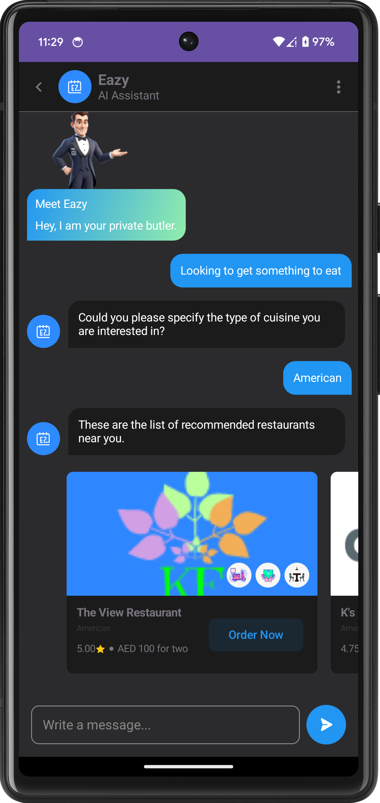
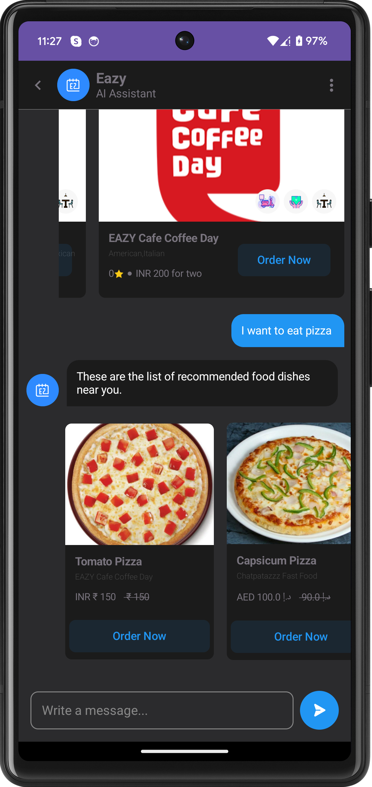

# Android AI Chat Bot

## Adding it to your project

To use this AI Chat Bot in your Android project, follow the below steps.

### Step 1: Prepare Your Keys

To integrate the SDK, ensure you have the following credentials ready:

- `chatBotId`
- `userId`
- `licenseKey`
- `appSecret`
- `storeCategoryId`
- `location`
- `latitude` (optional)
- `longitude` (optional)


### Step 2: Configure Project Repositories

Ensure your project's build.gradle (Project Level) file contains the following repositories:

```groovy
allprojects {
    repositories {
        mavenCentral()
        maven { url 'https://jitpack.io' }
    }
}
```

### Step 3: Add the Dependency

Open your build.gradle file (app-level) and add the following line in the dependencies section:

```groovy
dependencies {
    implementation 'com.github.isometrikai:android-ai-chatbot:1.0.5'
}
```
### Step 4: Sync Your Project

Once you've made the changes, sync your project with the Gradle files by clicking the "Sync Now" button in Android Studio.


# SDK Integration Guide

Follow the steps below to integrate and configure the Android Chat Bot SDK in your Android project.

## Step 1: SDK Initialization

Initialize the SDK in your project's `Application` class, specifically within the `onCreate()` method.

```kotlin
AiChatBotSdk.instance?.sdkInitialize(this)
```

## Step 2: SDK Configuration

Configure the SDK in the first method called in your app, typically within the `Application` class's `onCreate()` method.

```kotlin
 AiChatBotSdk.instance?.createConfiguration(
            chat_bot_id,
            app_secret,
            license_key,
            user_id,
            store_category_id,
            location,
            latitude,
            longitude
        )

```

### Step 3: Open a chat bot screen
You are now ready to open a chat bot screen. You can launch ChatBotActivity click action in your app:

```kotlin
 val i = Intent(this,ChatBotActivity::class.java)
            startActivity(i)
```

### Step 4: Implement widget click listener

```kotlin

 AiChatBotSdk.instance?.addBotActionsListener(object : BotActionsListener{
            override fun onWidgetActionClick(widget: Widget) {
                Toast.makeText(this@MainActivity,"Click: ${widget.title}",Toast.LENGTH_LONG).show()
            }
        })

```

# Technical details

* compileSdkVersion  = 34
* targetSdkVersion 34
* Android gradle plugin 8.5.0
* Kotlin version 1.9.0
* composeBom 2024.09.03


<p float="left">
  
  
  
  
</p>


